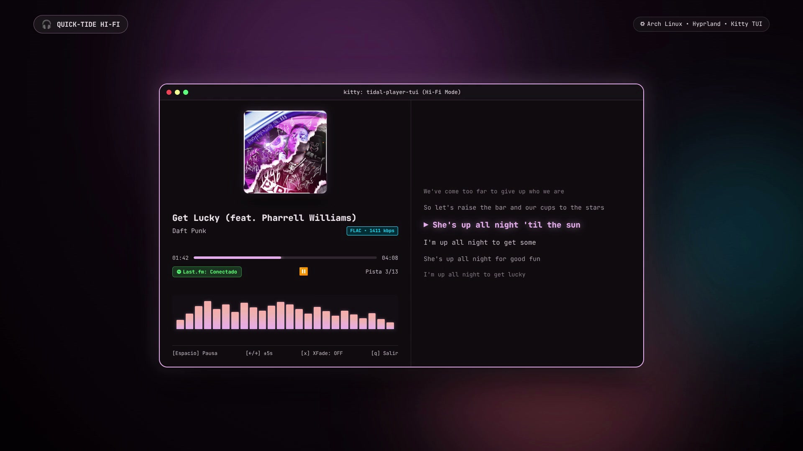

# 🌊 Quick-Tide (Tidal Hi-Fi Suite)

<p align="center">
  
</p>

<p align="center">
  <b>Quick-Tide</b>: lanzador flotante y reproductor TUI de alta fidelidad para Tidal en Arch Linux y Hyprland.
  <br>
  <i>Audio sin pérdidas FLAC / Hi-Res, visualizador de audio en tiempo real con CAVA, letras sincronizadas con LRCLIB, crossfade simultáneo de doble deck y scrobbling nativo con Last.fm. 🎧✨</i>
</p>

<p align="center">
  <a href="assets/media/demo.mp4">
    
  </a>
  <a href="https://archlinux.org">
    
  </a>
  <a href="https://last.fm">
    
  </a>
  <a href="https://sw.kovidgoyal.net/kitty/">
    
  </a>
  <a href="https://pipewire.org">
    
  </a>
</p>

---

## 🎬 Demostración en Video

<!-- ================================================================= -->
<!-- REPRODUCTOR DE VIDEO NATIVO DE GITHUB (USER-ATTACHMENTS)          -->
<!-- Pega tu enlace de user-attachments en el atributo 'src' a continuación: -->
<!-- ================================================================= -->

<video src="TU_ENLACE_DE_USER_ATTACHMENTS_AQUI" controls width="100%" poster="assets/media/preview.jpg">
  Tu navegador no soporta el tag de video. Puedes ver o descargar el video directamente en <a href="assets/media/demo.mp4">assets/media/demo.mp4</a>.
</video>

> 🎥 **[Haz clic aquí para ver o descargar el video de demostración (demo.mp4)](assets/media/demo.mp4)**:
> Podrás apreciar la invocación flotante `Super + T`, la animación pop-in de búsqueda en tiempo real, la terminal TUI en Kitty con carátula en alta definición, las barras del espectro CAVA conectadas a PipeWire, las letras 3D sincronizadas con LRCLIB, el fundido simultáneo Equal-Power y el scrobbling instantáneo en Last.fm.

---

## ✨ Características Principales

### 🔍 Lanzador Flotante (`Super + T` / `tidal-search-gui`)
- **Estética Serpantinum & Liquid Glass**: Ventana flotante translúcida en PyQt6 + QML con animaciones fluidas y sombras esmeriladas.
- **Búsqueda instantánea multi-modo**: Alterna con `Tab` entre canciones (`tracks`), álbumes (`albums`) y playlists (`playlists`).
- **Exploración de Colecciones**: Entra directamente a tus playlists guardadas o a cualquier álbum para explorar sus canciones, filtrarlas en tiempo real y empezar a reproducir desde cualquier pista.
- **Escribir desde cualquier lugar**: Detección global de pulsaciones; navega con las flechas o selecciona una canción con el ratón y sigue escribiendo para buscar de inmediato sin perder el foco.
- **Badges de calidad oficiales**: Distintivos con colores de Tidal (Dorado para Hi-Res / MAX, Cian para FLAC / Lossless, Celeste para High y Gris atenuado para Low).

### 🎵 Reproductor TUI Hi-Fi (`tidal-player-tui`)
- **Carátulas nativas en Kitty**: Renderizado en alta resolución aprovechando el protocolo de gráficos `kitten icat`.
- **Visualizador CAVA real**: Espectro de audio de alta tasa de refresco conectado directamente a tu servidor de audio **PipeWire**.
- **Controles estándar de la industria**: Botón Play / Pausa centrado bajo la barra de progreso y contador de pistas (`Pista xx/xx`) alineado a la derecha.
- **Efecto de letras en lente 3D circular**:
  - Resaltado de la línea activa en negrita y color Mauve brillante con indicador ` ▶ `.
  - Curvatura parabólica hacia el interior y degradado suave de brillo/opacidad conforme las letras se alejan del centro.
  - Las líneas lejanas se funden progresivamente con el fondo oscuro hasta desaparecer sin dejar espacios planos.
- **Doble fuente de letras (Tidal + LRCLIB)**: Si una canción no tiene letra en Tidal, consulta automáticamente en segundo plano la base de datos libre de **[LRCLIB](https://lrclib.net/)** (sincronizada o plana).
- **Fundido Cruzado Real (True Dual-Deck Crossfade)**: Mezcla simultánea con arquitectura de doble deck MPV y ecualización de potencia acústica constante (`Equal-Power` con curvas seno/coseno). La siguiente canción comienza a sonar y subir de volumen mientras la actual finaliza y se desvanece suavemente sin baches de volumen ni cortes agresivos.
- **Integración MPRIS2**: Control multimedia completo desde atajos globales de teclado, widgets de barra y pantalla de bloqueo.

---

## 🏛️ ¿Cómo funciona? ¿Es un Addon de Low-Tide o Funciona Solo?

Este proyecto funciona como una **suite de integración / companion frontend** de **[low-tide](https://github.com/mrusme/low-tide)**:

1. **Gestión de Sesión & OAuth**: Tidal utiliza autenticación OAuth basada en navegador con renovación continua de tokens. Para evitar reinventar la rueda de login y no arriesgar tus credenciales, reutilizamos el cliente de sesión de `low-tide`, el cual guarda tus tokens en `~/.config/low-tide/session.json`.
2. **Una sola vez**: Solo necesitas descargar `low-tide` y loguearte **una única vez**. Una vez que el archivo `session.json` exista, **no necesitas volver a abrir low-tide nunca más**.
3. **Ejecución autónoma**: `quick-tide` (`tidal-search-gui`) y `tidal-player-tui` leen directamente las credenciales de ese archivo de sesión, se conectan a los servidores de Tidal para buscar y extraer streams FLAC/Hi-Res en MPV, descargan carátulas y administran la cola de reproducción por su cuenta.

---

## 📋 Requisitos del Sistema

- **Linux** (Probado en Arch Linux / Fedora / Ubuntu con Wayland o X11).
- **Terminal Kitty**: Requerido para renderizar las imágenes de carátula mediante `kitten icat`.
- **MPV**: Motor de reproducción de audio y backend de streaming.
- **CAVA**: Para la captura y análisis FFT de audio desde PipeWire.
- **Python 3** con las siguientes librerías:
  - `PyQt6` (instalable desde tu gestor de paquetes de sistema: `python-pyqt6`).
  - Dependencias provistas por el entorno de `low-tide` (`tidalapi`, `dbus-fast` / `dbus-next`).

---

## 🚀 Instalación y Puesta en Marcha

### Paso 1: Configurar la sesión de Tidal (vía low-tide)
Si aún no tienes `low-tide` configurado con tu cuenta de Tidal:

```bash
# 1. Clonar low-tide en ~/.local/share/low-tide
git clone https://github.com/pauljhdrake/low-tide.git ~/.local/share/low-tide
cd ~/.local/share/low-tide

# 2. Crear su entorno virtual e instalar dependencias
python3 -m venv .venv
source .venv/bin/activate
pip install -r requirements.txt

# 3. Iniciar sesión por única vez con Tidal
python -m lowtide
```
> Se abrirá un enlace en la consola. Ábrelo en tu navegador, confirma el inicio de sesión en tu cuenta de Tidal y sal de `low-tide` con `q`. Tu sesión quedará guardada en `~/.config/low-tide/session.json`.

---

### Paso 2: Instalar Quick-Tide
 
```bash
# 1. Clonar este repositorio
git clone https://github.com/LMNoriega/quick-tide.git ~/.local/share/quick-tide
cd ~/.local/share/quick-tide

# 2. Ejecutar el instalador automático
./install.sh
```

El instalador verificará las dependencias y creará los ejecutables en `~/.local/bin`:
- `quick-tide` / `tidal-search-gui`: Lanzador flotante QML.
- `quick-tide-player` / `tidal-player-tui`: Reproductor en terminal.

---

## ⚙️ Configuración para Hyprland

Añade las siguientes líneas a tu configuración de Hyprland (`~/.config/hypr/hyprland.conf` o tu archivo de keybinds):

```ini
# Atajo para abrir el buscador flotante
bind = $mainMod, T, exec, tidal-search-gui

# Reglas de ventana para el buscador flotante
windowrulev2 = float, class:^(tidal-search-gui)$
windowrulev2 = size 740 560, class:^(tidal-search-gui)$
windowrulev2 = center, class:^(tidal-search-gui)$
windowrulev2 = stayfocused, class:^(tidal-search-gui)$
windowrulev2 = dimaround, class:^(tidal-search-gui)$

# Regla para el reproductor TUI en Kitty
windowrulev2 = float, class:^(tidal-player-tui)$
windowrulev2 = size 1100 680, class:^(tidal-player-tui)$
windowrulev2 = center, class:^(tidal-player-tui)$
```

---

## ⚙️ Archivo de Configuración (`~/.config/quick-tide/config.toml`)

Quick-Tide lee sus preferencias de usuario desde `~/.config/quick-tide/config.toml`. Si el archivo o el directorio no existen, se crearán automáticamente con los valores por defecto la primera vez que se ejecute la aplicación.

### Ejemplo de Configuración:
```toml
# Quick-Tide Configuration File
# Ubicación: ~/.config/quick-tide/config.toml

# Calidad de audio: "low", "high", "lossless", "max"
# Por defecto: "lossless"
# Nota: "max" requiere una suscripción TIDAL Max (Hi-Res / FLAC 24-bit).
quality = "lossless"

# Duración del fundido cruzado (crossfade) en segundos al estar habilitado (alternar con 'x' en el reproductor).
# Por defecto: 5
# Nota: El crossfade siempre inicia desactivado (OFF) al arrancar independientemente de este valor.
crossfade = 5

[lastfm]
# Scrobbling nativo y estado "Now Playing" en Last.fm
enabled = true
username = "tu_usuario"
password = "tu_password"      # Se convierte automáticamente a hash seguro
api_key = "tu_api_key"        # Generable gratis en: https://www.last.fm/api/account/create
api_secret = "tu_api_secret"
```

### Opciones Disponibles:
| Clave | Valores permitidos | Por defecto | Descripción |
| :--- | :--- | :--- | :--- |
| `quality` | `"low"`, `"high"`, `"lossless"`, `"max"` | `"lossless"` | Calidad deseada de streaming de audio. Intenta usar la calidad especificada siempre que se pueda, con degradación elegante si la cuenta o pista no la soportan. `"max"` requiere suscripción TIDAL Max. |
| `crossfade` | entero (segundos) | `5` | Duración del fundido cruzado simultáneo en segundos. La pista siguiente empieza a sonar mientras la actual concluye, fundiéndose suavemente con curvas Equal-Power. Se activa y desactiva con la tecla `x`. Siempre inicia en `OFF` al arrancar. |
| `[lastfm].enabled` | `true` / `false` | `false` | Activa o desactiva la sincronización en tiempo real y scrobbles con Last.fm. |
| `[lastfm].username` | cadena | `""` | Tu nombre de usuario en Last.fm. |
| `[lastfm].api_key` | cadena | `""` | Clave API de Last.fm (o variable de entorno `LASTFM_API_KEY`). |
| `[lastfm].api_secret` | cadena | `""` | Clave secreta API de Last.fm (o variable de entorno `LASTFM_API_SECRET`). |

> 💡 **Comandos auxiliares de Last.fm:**
> - `tidal-player-tui --test-lastfm`: Verifica y prueba tu conexión con Last.fm.
> - `tidal-player-tui --setup-lastfm`: Asistente interactivo en terminal para configurar tus credenciales en 20 segundos.

---

## ⌨️ Guía de Teclas y Atajos

### En el Lanzador (`Super + T`):
| Tecla | Acción |
| :--- | :--- |
| `Texto / Cualquier tecla` | Escribe en el buscador desde cualquier punto (incluso con canciones seleccionadas). |
| `↑` / `↓` | Navega entre los resultados o las pistas de un álbum. |
| `Tab` | Cambia de modo entre Canciones, Álbumes y Playlists. |
| `Enter` | Reproduce la pista o entra a explorar el álbum/playlist seleccionado. |
| `Ctrl + P` / Botón | Reproduce el álbum o la playlist completa desde el principio. |
| `Esc` | Limpia el texto de búsqueda o cierra la ventana. |

### En el Reproductor TUI (`tidal-player-tui`):
| Tecla | Acción |
| :--- | :--- |
| `Espacio` | Alternar Reproducción / Pausa. |
| `←` / `→` | Retroceder / Avanzar 5 segundos. |
| `n` / `p` | Siguiente pista / Pista anterior en la cola. |
| `x` | Alternar Crossfade (`ON` / `OFF`) en tiempo real. |
| `q` | Salir del reproductor. |

---

## 💡 Agradecimientos y Créditos
- **[low-tide](https://github.com/pauljhdrake/low-tide)** por la integración con OAuth y `tidalapi`.
- **[LRCLIB](https://lrclib.net/)** por la base de datos libre y abierta de letras sincronizadas.
- **[CAVA](https://github.com/karlstav/cava)** por el motor de visualización de audio.
- **[Serpantinum](https://github.com)** por la paleta de colores y estética general.
